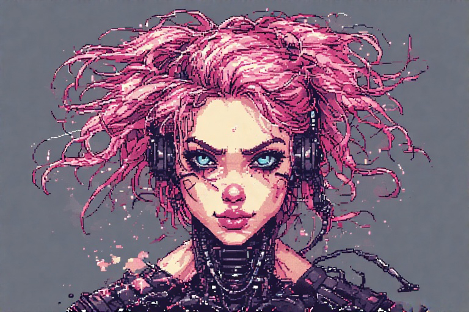
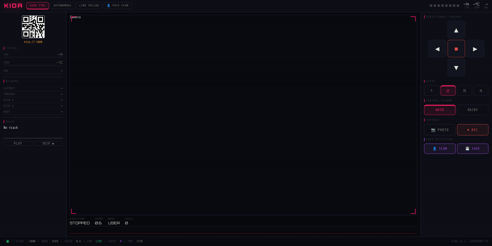

[](https://x.com/NorowaretaGemu)
[](https://opensource.org/licenses/MIT)
  
 <div align="center">
  <a href="https://ko-fi.com/cursedentertainment">
    
  </a>
</div>
<div align="center">
  
</div>

<div align="center">
  

</div>

<div align="center">
  
  
</div>

---

# KIDA (v00): Kinetic Interactive Drive Automaton

## 📖 Overview

<details>
<summary><b>Overview</b></summary>

KIDA v00 is the foundational entry in the Kinetic series, built on the Raspberry Pi 3 Model B. v00 is a versatile teleoperated and autonomous scout designed for robust remote monitoring and computer vision tasks.

Core Features
- [x] Multi-Protocol Control: Seamless operation via Web Interface, VNC, or direct Remote Control.
- [x] Live Surveillance: High-definition video streaming with on-demand image and video capture.
- [x] Biometric Inference: Edge-based vision processing for real-time Gender and Age detection.
- [x] Reactive Autonomy: Integrated Ultrasonic obstacle avoidance and high-contrast line-following logic.
- [x] Visual Feedback: Customizable RGB lighting for status signaling and environmental illumination.

</details>

---

<details>
<summary><b>Keybindings</b></summary>

### ⚙️ Mode Selection
Use the numeric keys to hot-swap between drive logics:
* <kbd>1</kbd> **Switch to Mode 1** (Standard WASD Vectoring)
* <kbd>2</kbd> **Switch to Mode 2** (Independent Tank-Style Control)

### 🏎️ Movement Controls

| Input | **Mode 1: Coordinated** | **Mode 2: Independent** |
| :--- | :--- | :--- |
| <kbd>Q</kbd> | — | Left Bank Forward |
| <kbd>A</kbd> | Rotate Left | Left Bank Backward |
| <kbd>W</kbd> | Move Forward | Right Bank Forward |
| <kbd>S</kbd> | Move Backward | Right Bank Backward |
| <kbd>D</kbd> | Rotate Right | — |
| <kbd>X</kbd> | Speed Control | Speed Control |
| <kbd>TAB</kbd> | Cycle Modes | Cycle Modes |
| <kbd>1</kbd> | — | Mode 1 |
| <kbd>2</kbd> | Mode 2 | — |


### 🎵 Media & System
* <kbd>M</kbd> **Play Music**
* <kbd>Space</kbd> **Stop Music** / Audio Interrupt

</details>

> [!TIP]
> Use **Mode 2** for heavy terrain or precise pivoting, and **Mode 1** for smooth, cinematic strafing.

---

## Related Projects

- [KIDA-Robot-v01](https://github.com/CursedPrograms/KIDA-Robot-v01)
- [WHIP-Robot-v00](https://github.com/CursedPrograms/WHIP-Robot-v00)
- [NORA-Robot-v00](https://github.com/CursedPrograms/NORA-Robot-v00)
- [DREAM/ComCentre](https://github.com/CursedPrograms/DREAM)
- [RIFT](https://github.com/CursedPrograms/RIFT)

---

<div align="center">
  
</div>
<br>

## Prerequisites
<details>
<summary><b>Prerequisites</b></summary>

### Software
- [Raspberry Pi OS](https://www.raspberrypi.com/software/operating-systems/)

## Hardware

### Compute
| **Component** | **Details** |
|-----------|---------|
| Main Board | Raspberry Pi 3B |
| GPIO Hat | Freenove Tank Robot HAT v2 |

### Chassis & Motion
| **Component** | **Details** |
|-----------|---------|
| Chassis | Robot Tank Chassis |
| Motors | 2× 5v DC Motors |

### User Controllers
| **Component** | **Details** |
|-----------|---------|
| Interface | PC, Android, iPhone |
| Controller | Wireless Keyboard |

### Cameras
| **Component** | **Details** |
|-----------|---------|
| Camera 0 | Raspberry Pi Camera |

### Sensors
| **Component** | **Details** |
|-----------|---------|
| Ultrasonic Sensors | HC-SR04|
| Line Follower | 3-Channel Line Tracking Sensor |

### Power System
| **Component** | **Details** |
|-----------|---------|
| Battery | 2s 18650|

</details>

---

# Schematics
## ⚡ Technical Pinouts

> [!IMPORTANT]
> This section describes the GPIO pin assignments for the KIDA robot.


KIDA uses the V2 robot Hat from the [Freenove Tank Robot](https://github.com/Freenove/Freenove_Tank_Robot_Kit_for_Raspberry_Pi): 

<details>
<summary><b>Freenove Tank Robot HAT v2 GPIO Configuration</b></summary>

## Ultrasonic Sensor (HC-SR04)

| Signal       | GPIO Pin |
|-------------|----------|
| TRIGGER_PIN | 27       |
| ECHO_PIN    | 22       |

---

## Servos

| Signal       | GPIO Pin |
|-------------|----------|
| Servo0 | 12       |
| Servo1    | 13       |

---

## LEDpixel

| Signal       | GPIO Pin |
|-------------|----------|
| LEDpixel | 10      |

---

## Infrared Sensors

| Sensor | GPIO Pin |
|--------|----------|
| IR01   | 16  (IR01) |
| IR02   | 26  (IR02) |
| IR03   | 21  (IR03) |

---

## Motor Pins

**Left Motor:**

| Signal | GPIO Pin |
|--------|----------|
| IN1    | 23 (M1+) |
| IN2    | 24 (M1-) |

**Right Motor:**

| Signal | GPIO Pin |
|--------|----------|
| IN1    | 6  (M2+) |
| IN2    | 5  (M2-) |

</details>

*Note:* These pins correspond to the constructor defaults:

---

## 🌐 Connectivity & Controls

<details>
<summary><b>Connectivity & Controls</b></summary>

### Network Configuration
| Parameter | Value |
| :--- | :--- |
| **SSID** | `NORA` |
| **Password** | `12345678` |

* `localhost:5002`

### RIFT Integration
To connect via [RIFT](https://github.com/CursedPrograms/RIFT), ensure KIDA01 is active on:
* `localhost:5003`
- Opening this address in any web browser on the same network, will also launch the **HTML Remote Controller** for manual overrides.


</details>

---

<div align="center">
  
</div>
<br>

---

## Setup:

### Environment Setup

<details>
<summary><b>Environment Setup</b></summary>

```bash
python3 -m venv venv
source venv/bin/activate
pip install --upgrade pip
pip install -r requirements.txt
```

</details>

---

## How to run:

<details>
<summary><b>How to run:</b></summary>

**1. Standard Execution**
- Run the main application using the Python interpreter:

```bash
python run.py
```

**2. Using Shell Scripts**
- If you prefer using shell scripts, first ensure the files have the necessary execution permissions:

```bash
chmod +x make_executables.sh
```

- To launch the main environment:

```bash
./run.sh
```

#### 🤖 Autonomous Behaviors
- To execute a single autonomous behavior, run the corresponding script:

#### Line Follower:

```bash
./run_linefollower.sh
```

#### Obstacle Detection:

```bash
./run_obstacle_detection.sh
```

</details>

*Note:* You can also just double click on any *.sh

> [!IMPORTANT]
> Ensure you have granted permissions via chmod before attempting to run the .sh files for the first time.

---

<br>
<div align="center">
© Cursed Entertainment 2026
</div>
<br>
<div align="center">
<a href="https://cursed-entertainment.itch.io/" target="_blank">
    
</a>
</div>
